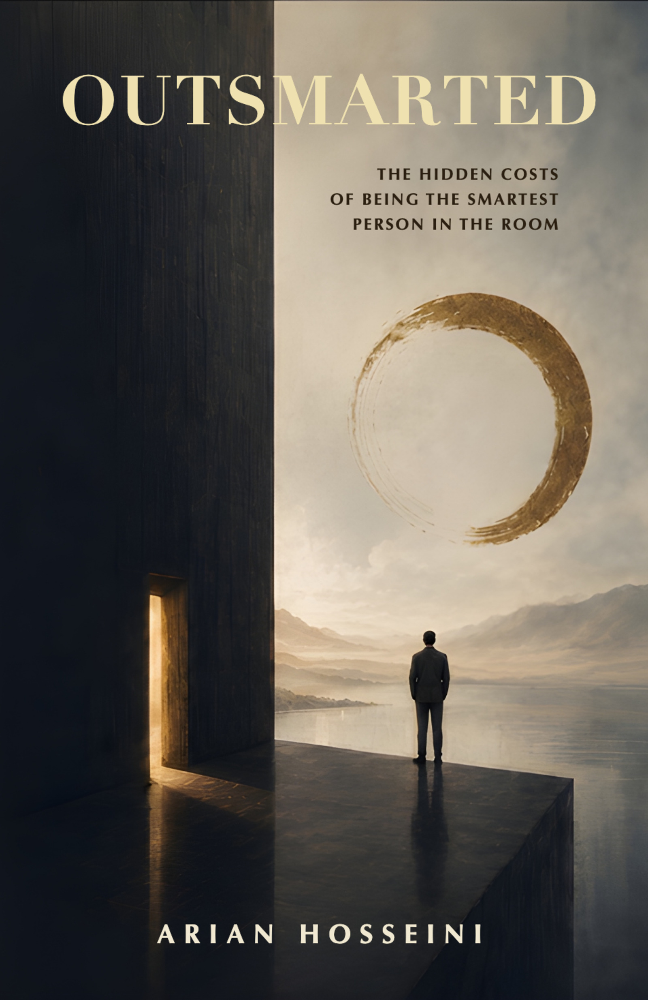

# Outsmarted: The Hidden Costs of Being the Smartest Person in the Room

  

## A rare book that is actually honest about intelligence

Most books about intelligence make one of two mistakes.

They either celebrate smart people as misunderstood heroes, or criticize them as detached elites.

**Outsmarted** does neither.

Instead, it asks a harder question:

> What if many of the traits that helped us succeed also quietly made us lonely?

Written by AI researcher and engineering leader **Arian Hosseini**, *Outsmarted* is part memoir, part social commentary, and part field guide to the modern cognitive elite at the moment AI is repricing it.

The book introduces a series of ideas that stayed with me long after I finished reading:

* **The Lowered Hand** — the moment a gifted child learns that being right faster than the room is not always rewarded.
* **The Translation Tax** — the cognitive and emotional bill smart people pay to convert every thought into something the room can accept.
* **The Cleverness Ceiling** — why the colleague with worse technical work just got promoted past you, and what kind of work actually pays above it.
* **Love After Translation** — what happens when optimization becomes the lens through which you evaluate the people you try to love.
* **The Mirror in the Machine** — what happens when AI begins performing the very work that gave the cognitive elite its identity.

What makes the book unusual is not the ideas themselves.

It is the honesty.

The author openly describes moments where intelligence helped him succeed, but also moments where it damaged relationships, distorted judgment, and became a substitute for genuine connection.

One scene describes returning to a hotel room after a major academic recognition and realizing there was nobody he wanted to call.

Another describes a woman he tried to date at twenty-two telling him, near the end, *"You are like a detective, trying to find bugs in me. That is not love."* He admits he has not, in the years since, fully unlearned the move.

A third revisits his own father, who never went to medical school but spent thirty years as an anesthesia specialist and could read an X-ray almost as fast as the doctors he worked alongside. The chapter quietly redefines what competence is.

Those passages stayed with me far longer than any discussion of IQ.

## Who should read it?

This book will resonate most with:

* Engineers
* Researchers and scientists
* Physicians
* Founders and operators
* Professors and graduate students
* Former gifted kids
* High achievers in any field
* Anyone who has tied their self-worth too closely to achievement
* Anyone who lives with one of the above

## Favorite passage

> "The loneliness was not the cost of being smart. The loneliness was the cost of having traded, deliberately, every piece of relational infrastructure I might have had for a citation count."

## Rating

★★★★★

One of the most thoughtful books I have read about achievement, intelligence, identity, and the strange emotional tradeoffs that come with all three.

## Get the book

* Kindle: https://www.amazon.com/dp/B0H3DJF4HP
* Paperback: https://www.amazon.com/dp/B0H3GTC8F2
* Hardcover: https://www.amazon.com/dp/B0H3GQ47RB
